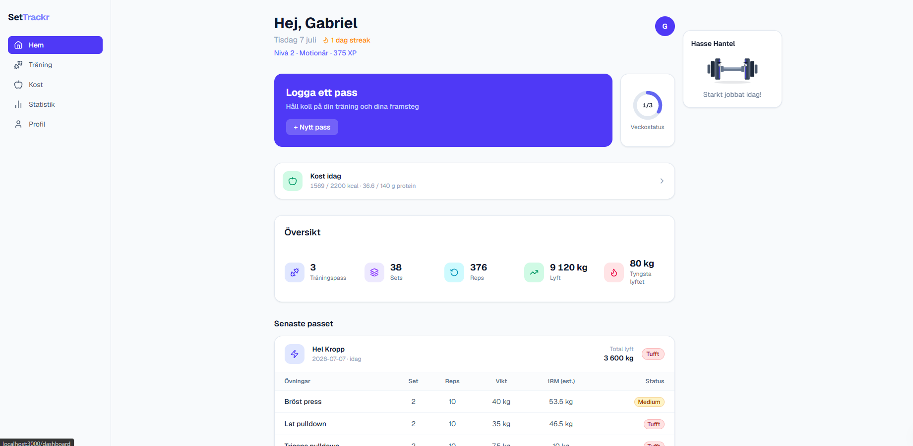
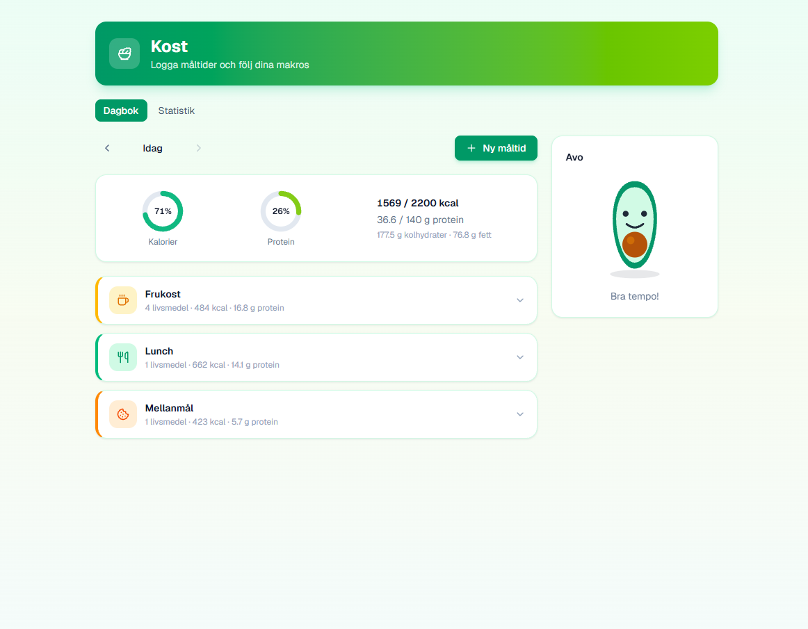
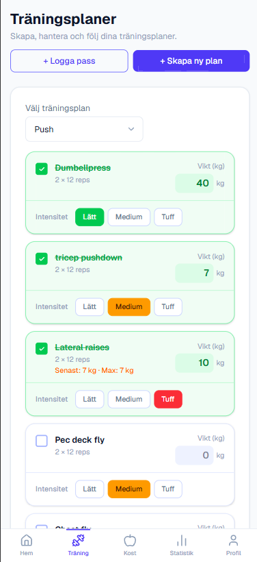
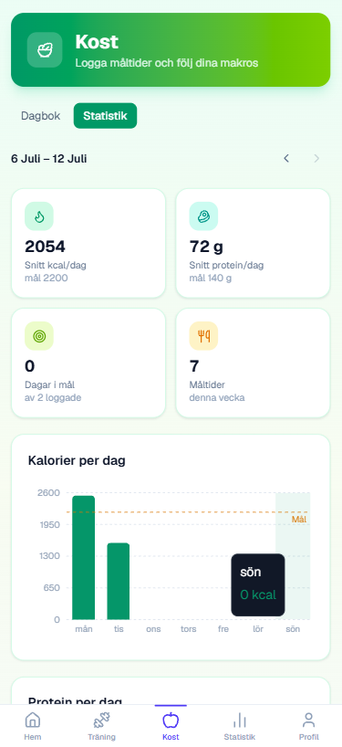

# SetTrackr

### Background
Gym web app where you can track your workouts with set and rep tracking. The user inputs each workout with name, weight, reps, sets. This get stored and you can view your progress on a statistics page.

### Screenshots

<table>
  <tr>
    <td> Dashboard — daily overview, streaks, and Hasse Hantel</td>
    <td> Food diary — meal tracking with Avo</td>
  </tr>
  <tr>
    <td> Logging a workout (mobile)</td>
    <td> Weekly nutrition stats (mobile)</td>
  </tr>
</table>

### TeckStack
Client-side
- Next.js
- Tailwind css
- Auth.js (google login)

Server-side
- FastAPI
- Swagger (endpoint testing)
- JWT verification
- PostgreSQL (via Supabase)

### Mobile (PWA)

SetTrackr is a Progressive Web App and can be installed on iPhone via Safari:

1. Open [settrackr.vercel.app](https://settrackr.vercel.app) in Safari
2. Tap the Share button → **Add to Home Screen**
3. Tap **Add**

The app opens fullscreen with no browser UI, just like a native app.

### Deployment

The app is live at **[settrackr.vercel.app](https://settrackr.vercel.app)**.

- Frontend is hosted on [Vercel](https://vercel.com) and deploys automatically on every push to `main`
- Backend is hosted on [Render](https://render.com) and also deploys automatically on push
- Database runs on [Supabase](https://supabase.com)